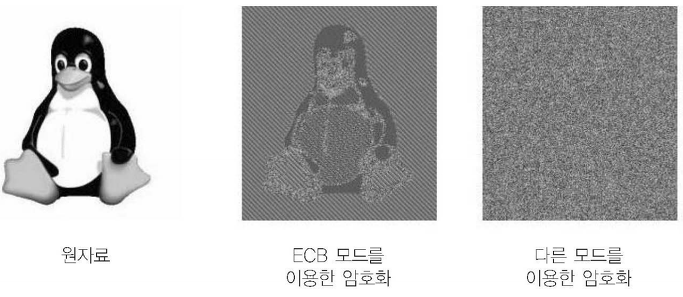

# 블록암호 : 운영모드

### 서론

DES나 AES와 같은 블록 암호는 한 번에 한 블록의 평문을 암호화하기 위해 설계됨(DES는 64비트, AES는 128비트)

UTF-8로 인코딩할 때, 알파벳 한 글자는 8비트에 대응되므로 DES와 AES는 각각 8글자, 16글자를 한번에 암호화할 수 있음

그런데 일반적으로 사용되는 평문의 길이는 이 길이들을 넘는 경우가 많아서 블록 암호로 이러한 다양한 크기의 데이터를 처리할 수 있도록 고안된 블록 암호의 사용 방법이 **운영모드**

### 패딩

블록 암호는 블록 단위로 암호화를 하므로 입력의 길이가 정확하게 블록 크기의 배수여야 하는데 일반적으로 배수가 되지 않음

이런 문제를 해결하기 위해 평문에 데이터를 붙여 평문의 크기가 블록 크기의 배수가 되도록 만드는 과정이 **패딩(Padding)**

패딩된 암호문을 복호화할 때는 평문에서 패딩을 제거해야 원래의 패딩을 얻을 수 있음

널리 사용되는 패딩 기법으로는 **비트 패딩(bit padding), 바이트 패딩(byte padding), 그리고 PKCS#7** 패딩이 있음

#### 비트 패딩

**비트 패딩**은 마지막 블록에서 평문이 채우지 못하는 비트 중 최상위 비트를 1로 설정하고 나머지는 모두 0으로 채우는 패딩 기법

이 방식은 평문이 정확히 블록 크기의 배수일 때 메세지의 일부를 패딩으로 오인할 수 있는데, 이를 막기 위해 비트 패딩을 적용할 때는 <u>평문의 크기가 블록 크기의 배수이면 패딩으로 한 블록을 추가</u>

예를 들어 평문이 | 1100 | 이면 수신자는 뒤의 세 비트를 패딩으로 인식하고 제거하므로 |1100 | 1000 | 같이 뒤에 한 블록을 추가해야 함

 #### 바이트 패딩 : ANSI X.923

**바이트 패딩(Byte Padding)**은 바이트 단위로 패딩을 수행하는 패딩 기법

**ANSI X.923**은 마지막 블록의 남는 바이트를 임의의 값(일반적으로 0)으로 채우고, 마지막 바이트에 패딩의 길이를 기록하는 기법

ANSI X.923 또한 평문의 길이가 블록 크기의 배수일 때, 수신자가 평문을 패딩으로 오해할 수 있으므로 평문의 크기가 블록 크기의 배수일 때는 마지막에 한 블록을 패딩으로 추가

#### 바이트 패딩 : PKCS#7

***PKCS(Public-Key Cryptography Standart)**는 공개키 암호의 표준 문서로서, 그중 7번째 문서인 PKCS#7은 AES와 같은 블록 암호의 패딩 기법을 제시하고 있음

PKCS#7에 소개된 패딩 기법은 추가할 패딩의 바이트 크기로 마지막 블록을 채우는 패딩 기법

다른 패딩 기법들과 마찬가지로 평문의 크기가 블록 크기의 배수이면 PKCS#7은 | 08 08 08 08 08 08 08 08 |을 패딩으로 추가

### 운영모드

#### ECB 모드

블록 암호로 평문을 암호화할 때 평문은 패딩을 거친 뒤 여러 블록으로 나뉨.

그리고 각각의 블록은 블록 암호의 운영모드에 따라 암호화 됨

**ECB(Electronic Code Book)** 모드는 가장 간단한 운영모드로, <u>블록들은 모두 같은 키로 암호화</u>됨

ECB 모드에서는 각 블록이 독립적으로 암호화되므로 여러 블록을 병렬적으로 암호화할 수 있다는 장점이 있지만, 다른 운영모드에 비해 암호학적 안전성이 부족하다는 단점이 있음

#### ECB 모드의 취약점

ECB모드를 사용하면, 같은 블록은 같은 암호문으로 암호화됨. 이 특징을 이용하면 공격자는 암호문에서 평문의 정보를 습득하거나, __리플레이 공격__을 수행하는 것이 가능해짐

***약한 혼돈 성질***

#### 재전송 공격

어떤 데이터를 재전송하여 시스템이 의도치 않은 행동을 하게 하는 것을 __재전송 공격(Replay Attack)__이라고 함

### CBC 모드

CBC(Cipher Block Chaining) 모드는 어떤 블록을 암호화하기 전에, 이 블록을 직전 블록의 암호문과  XOR 함

평문의 첫 번째 블록은 이전 블록이 존재하지 않으므로, 초기 벡터(Initialization Vector, IV)라고 불리는 임의의 데이터와 XOR

이 모드를 사용하면 각 블록이 서로의 암호화에 영향을 주므로 같은 블록도 전체 평문 및 IV에 따라 암호화 결과가 달라짐

초기 벡터는 일반적으로 __논스(Nonce, number used only once)__라는 무작위 값을 사용하며, <u>이는 공격자가 알아도 안전성에 영향을 끼치지 않음</u>

그러나 만약 공격자가 암호문을 중간에 가로채서 이를 조작할 수 있으면, 복호화 결과의 첫 번째 블록을 조작할 수 있음.

그러므로 CBC 모드를 사용할 때는 초기 벡터의 무결성을 함께 보장해야 함

CBC 모드는 한 블록을 암호화할 때 직전 블록의 암호화 결과를 사용하므로 여러 블록을 병렬적으로 암호화할 수 없음.

그러나 복호화의 경우 모든 암호문 블록을 알고 있으므로 병렬적으로 처리할 수 있음.

CBC모드는 재전송 공격에 강인하며, 높은 혼돈성을 가지고 있어서 블록 암호의 운영모드로 널리 사용되고 있음

#### CBC Bit-Flipping Attack

공격자가 초기 벡터를 원하는 값으로 조작하여 복호화된 평문의 첫 번째 블록을 조작하는 공격을 CBC Bit-Flipping Attack이라고 함

#### CTR 모드

__CTR(Counter)__모드는 블록 암호에 <u>nonce와 평문 블록의 인덱스(counter)</u>를 결합한 값을 입력

암호문은 블록 암호의 출력과 평문 블록을 XOR 하여 생성

블록을 순서대로 암복호화하지 않아도 되므로 병렬로 암복호화할 수 있으며, 구현이 간단하다는 장점이 있음

